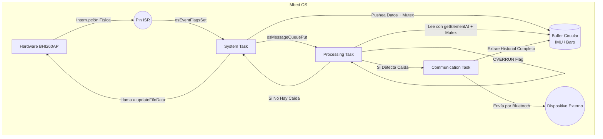
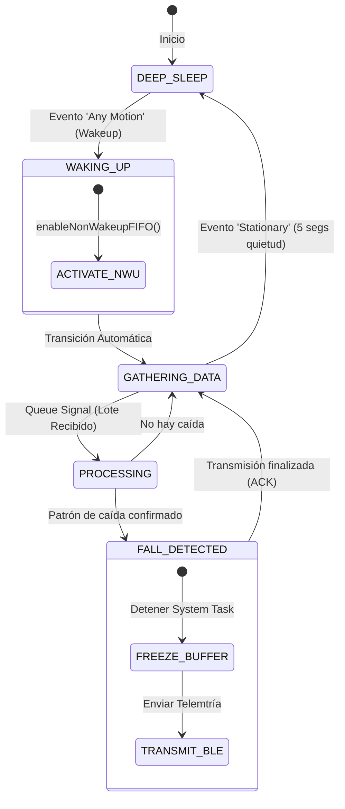
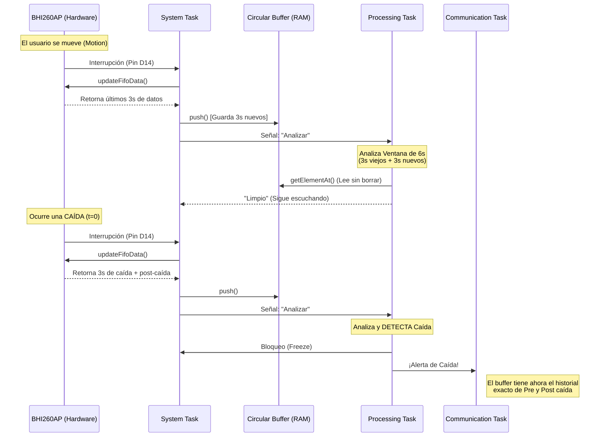

# Arquitectura del Pipeline de Datos (Propuesta RTOS)

Este documento detalla la lógica de concurrencia y el flujo de datos diseñado para la detección de caídas, orquestando las interrupciones del hardware y las tareas del sistema operativo (Mbed OS).

## 1. El Flujo de Estados y Tareas

El sistema se divide en tres Tareas (Threads) principales y una sub-rutina de interrupción:

1. **ISR (Interrupt Service Routine):**
   * Es la interrupción de hardware pura (el pin físico).
   * **Única responsabilidad:** Setear un flag (`osEventFlagsSet`) para despertar a la *System Task*. No ejecuta lógica ni I2C.

2. **System Task (Tarea Maestra):**
   * Es el hilo bloqueado esperando el flag del ISR.
   * **Modo Reposo:** Mantiene el BHI260 con la Non-Wakeup FIFO apagada (Host Suspended). Solo escucha eventos Wakeup (One-shot de Motion o Stationary, evaluados en ventanas de 5 segundos).
   * **Modo Activo:** Si detecta "Motion", despierta la Non-Wakeup FIFO, lo que hace que comiencen a ingresar datos regulares (Acelerómetro, Barómetro).
   * **Extracción de Datos:** Cuando despierta por el ISR, llama a `updateFifoData()`. Esta función bloqueante drena la FIFO de hardware completa hacia los buffers circulares de las clases driver.
   * **Notificación:** Una vez finalizado el parseo de un lote (chunk), envía un mensaje por RTOS Queue a la *Processing Task*.

3. **Processing Task (Detección de Caídas):**
   * Se despierta al recibir el comando de la Queue.
   * **Análisis con Ventana Solapada (Overlapping):** Dado que una caída dura aproximadamente 3 segundos, la tarea analiza un `CHUNK_PROCESAMIENTO` del doble de tamaño (ej. 6 segundos). Cada vez que ingresa un nuevo lote de 3 segundos, la tarea analiza los 3 segundos "nuevos" concatenados con los 3 segundos "viejos" de la iteración anterior. Esto garantiza un solapamiento del 50%, eliminando el punto ciego que ocurriría si la caída quedase cortada exactamente a la mitad de dos lotes.
   * **Lectura No Destructiva:** Analiza el "centro" del buffer usando índices (sin hacer `.pop()`). Esto garantiza que, si se detecta un impacto en esa ventana central, el buffer mantiene intactos los segundos anteriores al impacto (Pre-caída) y los segundos posteriores (Post-caída).
   * **Manejo de Sobrecarga (Overrun Flag):** Si la tarea se retrasa y recibe un nuevo aviso de interrupción mientras aún estaba procesando, la *System Task* levantará un flag de sobrecarga (`OVERRUN`). Al terminar su ciclo, si la *Processing Task* detecta este flag, ejecutará un escaneo profundo de todo el buffer (Sweep completo) para garantizar que no se haya perdido ninguna caída en el historial solapado.
   * **Decisión:** 
     * *No hay caída:* Avisa a la *System Task* que es seguro seguir inyectando datos.
     * *Hay caída:* Detiene el flujo (frena temporalmente a la System Task para evitar sobrescrituras) y notifica a la *Communication Task*.

4. **Communication Task (Envío Telemétrico):**
   * Al recibir la alerta, extrae el buffer completo de la IMU (el historial Pre/Post caída) junto con los estados del barómetro y temperatura.
   * Empaqueta la telemetría y la transmite al servidor o dispositivo Bluetooth.
   * Al finalizar, libera el sistema para volver a la detección normal.

## 2. Control de Concurrencia y Cuellos de Botella

* **Alcance de los Drivers:** Como las clases de los sensores (`ImuSensorDriver`, etc.) no son Singletons puros, se deben instanciar de forma **global** o en el `main` y pasar sus punteros/referencias a las tareas del RTOS. Si cada tarea instancia su propia clase, tendrán buffers de memoria aislados y el sistema no funcionará.
* **Seguridad de Memoria (Thread-Safety):** La *System Task* (Productor) y la *Processing Task* (Consumidor) tocan el mismo buffer circular. Es obligatorio envolver los métodos del buffer en un Mutex (`osMutexAcquire`/`Release`) o Critical Section para evitar la corrupción de los índices lógicos.
* **Sobreescritura Justificada:** Si el hardware satura el tamaño máximo del buffer de software (ej. 800 muestras), los datos más viejos se pisan. Esto es por diseño: el buffer solo existe para retener el historial reciente (ej. los últimos 16 segundos). Los datos más viejos pierden relevancia para la telemetría de una caída actual.
* **Backpressure:** La latencia configurada en el sensor (ej. `LATENCIA_DATOS_ACCELEROMETRO`) dicta el ritmo de los lotes. El algoritmo matemático de la *Processing Task* debe estar altamente optimizado para finalizar su análisis antes de que venza la próxima latencia del hardware; de lo contrario, el RTOS formará un cuello de botella y el hardware FIFO se desbordará.

## 3. Esquema de Buffer con Retraso Intencional (Delayed Sliding Window)

Una de las decisiones de diseño más robustas del sistema es el método de extracción de datos para telemetría. Al evaluar posibles caídas, la *Processing Task* **nunca analiza los datos más recientes** (los que están en la cabeza del buffer). En su lugar, el algoritmo analiza una ventana de datos ubicada intencionalmente "en el pasado".

Al introducir este retraso (Lag) entre el puntero de escritura (Head) y la ventana de análisis, el sistema se garantiza de forma pasiva capturar el futuro inmediato (Post-caída) relativo al evento. Si la ventana de análisis detecta un impacto, los datos correspondientes a los segundos posteriores ya habrán ingresado físicamente al buffer, eliminando la necesidad de programar temporizadores de espera.

### Diagrama Lógico del Buffer al momento de la Congelación (Fall Detected)

```text
  TAIL (Dato más viejo)                                    HEAD (Dato más nuevo)
   |                                                                |
   v                                                                v
[========================================================================]
   |--------------------|-----------------------|-------------------|
      TIEMPO_PRE_FALL      CHUNK_PROCESAMIENTO    TIEMPO_POST_FALL  
        (Historial)       (Ventana de Impacto)      (Nuevos Datos)    
```

* **`CHUNK_PROCESAMIENTO`**: Es la ventana de datos real que la *Processing Task* extrae (usando métodos no destructivos como `getElementAt`) y somete al algoritmo matemático para buscar picos de caída.
* **`TIEMPO_POST_FALL`**: Es el margen de "retraso" intencional. Son datos que ya ingresaron a la cola mientras el algoritmo analizaba la ventana. Proveen la evidencia telemétrica de que el usuario quedó tendido en el piso tras el impacto.
* **`TIEMPO_PRE_FALL`**: Son los datos previos a la ventana de análisis. Sirven para que el servidor entienda el contexto de la caída (ej. si la persona venía corriendo, caminando o estaba de pie).

Cuando la *Processing Task* confirma la caída en el `CHUNK_PROCESAMIENTO`, emite inmediatamente la señal de **alto** (congelando el buffer para evitar sobreescrituras). En ese exacto instante, la *Communication Task* puede leer el buffer completo, obteniendo automáticamente el empaquetado perfecto de Pre-caída, Impacto y Post-caída.

## 4. Diagramas de Arquitectura (Representaciones Visuales)

Para facilitar la comprensión del flujo y poder exponerlo de manera gráfica, a continuación se presentan tres diagramas utilizando la sintaxis de Mermaid.

### 4.1 Diagrama de Flujo (Flujo de Datos y Tareas)

Este diagrama muestra cómo interactúan las distintas tareas del RTOS mediante señales y colas (Queues).



### 4.2 Diagrama de Máquina de Estados (MDE - Estados del Sistema)

Este diagrama modela el estado general del dispositivo, ideal para entender la lógica de bajo consumo (Low Power).



### 4.3 Diagrama de Secuencia (Temporalidad y Solapamiento)

Este diagrama ilustra la interacción a lo largo del tiempo, mostrando el mecanismo de retraso (Delay) y el solapamiento.



## 5. Próximos Pasos Técnicos (TODOs)

Para materializar esta arquitectura en el código base, quedan pendientes los siguientes desafíos técnicos:

* **[TODO] Definición del Scope de las Clases (Variables Globales vs Inyección):**
  Dado que las clases (`ImuSensorDriver`, `PressureSensorDriver`) no son *Singletons*, deben ser instanciadas de forma que la *System Task* y la *Processing Task* interactúen exactamente con el mismo objeto en memoria. Se evaluará si se declaran de forma **Global** en `main.cpp` o si se inyectan sus punteros en el inicio de los hilos de RTOS.

* **[TODO] Mecanismo de Protección de Concurrencia (Mutex/Critical Section):**
  Es imperativo desarrollar e integrar cerrojos de protección (RTOS Mutex o `core_util_critical_section`) envolviendo los métodos `push()` y `getElementAt()` del buffer circular, para prevenir corrupción de índices durante accesos simultáneos.

* **[TODO] Escaneo Profundo por Sobrecarga (Full Buffer Sweep):**
  Implementar la sub-rutina de contingencia que, en caso de detectarse el flag de `OVERRUN` (retraso en el RTOS), efectúe un barrido de emergencia recorriendo toda la longitud del buffer circular para garantizar que no haya "micro-caídas" ignoradas en el backlog.

* **[SUGERENCIA/TODO] Encapsulamiento del Procesamiento en la Clase IMU:**
  Para evitar extraer o copiar fragmentos de memoria continuamente hacia el entorno de la *Processing Task* (lo que consume ciclos de CPU), se propone **evaluar que la función matemática de detección de caídas exista internamente dentro del propio `ImuSensorDriver`**. De esta forma, la tarea del RTOS solo invocaría algo como `imuDriver.detectFall(window_size, lag_offset)`, delegando el análisis al objeto que es dueño directo de la memoria de forma más rápida y segura.
